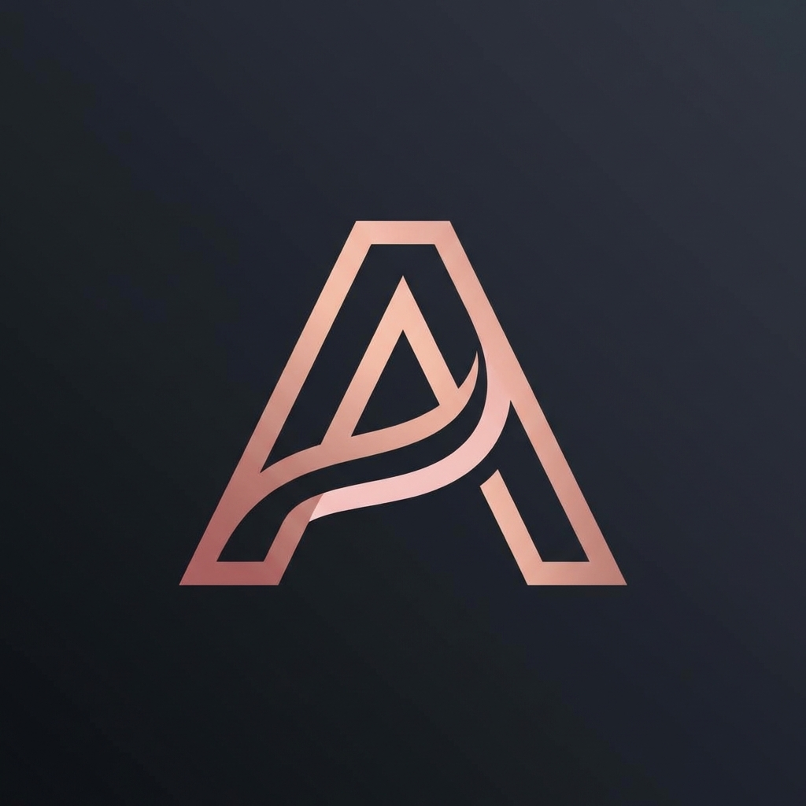

<div align="center">



# 🌹 Aria

### _High-End Interactive Fiction & AI Companion Suite_

<br/>

[](https://github.com/Gakuseei/Aria)
[](https://github.com/Gakuseei/Aria)
[](LICENSE.md)
[](https://github.com/Gakuseei/Aria)

<br/>

**A premium, fully local AI chatbot for immersive storytelling and character interactions.**

_Your conversations. Your device. Your privacy._

<br/>

[](https://discord.gg/h3gVtkw9ja)
[](https://ko-fi.com/gakuseei)

</div>

---

<br/>

## 🚀 Early Access

> [!NOTE]
> **Aria is in active development.** Features and UI may change as we work towards v1.0.
> Check the [Roadmap](#-roadmap) for upcoming updates or join our [Discord](https://discord.gg/h3gVtkw9ja) for the latest news!

<br/>

---

<br/>

## ✨ Features

<table>
<tr>
<td width="50%" valign="top">

### 🔐 100% Private & Offline

Your conversations **never leave your device**. Aria runs entirely on your local machine using [Ollama](https://ollama.ai), ensuring complete privacy and zero data collection.

<br/>

### 🎭 Custom Characters

Create unique AI companions with custom personalities, backstories, and traits. Save, manage, and share multiple characters effortlessly.

<br/>

### 🌍 13 Languages

Full localization including English, German, Spanish, French, Italian, Portuguese, Russian, Japanese, Korean, Chinese, Arabic, Hindi, and Turkish.

</td>
<td width="50%" valign="top">

### 📚 Easy Tutorials

Interactive, built-in tutorials for quick onboarding – Voice synthesis, Image Generation, and Ollama setup all included.

<br/>

### 🎨 Stunning Rose-Noir UI

Premium aesthetic with smooth animations, glassmorphism effects, and optional OLED dark mode. **Gold Mode** available for supporters.

<br/>

### 🔥 Passion System

A hidden relationship engine that evolves based on your choices. Unlock deeper emotional tiers, new dialogue styles... and discover what lies beyond.

</td>
</tr>
</table>

<div align="center">

### 💡 Smart Suggestions • 📦 Easy Import/Export • 🎙️ Voice Synthesis

</div>

<br/>

---

<br/>

## 🚀 Quick Start

<div align="center">

Aria includes **built-in tutorials** – just launch and follow the interactive guides!

</div>

<br/>

### 📋 Prerequisites

| Requirement | Details                            |
| :---------: | :--------------------------------- |
| **Node.js** | v18 or higher                      |
| **Ollama**  | [Download here](https://ollama.ai) |
|   **RAM**   | 8GB minimum _(16GB recommended)_   |
|   **GPU**   | Optional – speeds up AI responses  |

<br/>

### ⚡ Installation

```bash
# 1. Clone or download the project
git clone https://github.com/Gakuseei/Aria.git

# 2. Navigate to the folder
cd Aria

# 3. Install dependencies
npm install

# 4. Launch Aria
npm run dev
```

> [!TIP]
> On first launch, Aria will guide you through pulling an AI model and setting everything up automatically!

<br/>

---

<br/>

## 🗺️ Roadmap

<div align="center">

_Building the ultimate AI companion experience, one feature at a time._

</div>

<br/>

<details>
<summary><strong>✅ Completed</strong></summary>

<br/>

- [x] Voice System Repair & Settings Storage Fix
- [x] Ko-Fi Integration & Gold Mode Visuals
- [x] Language System _(i18n with 13 languages)_
- [x] Premium Start Animation
- [x] Image Generation Polish & Context Cleaner

</details>

<details open>
<summary><strong>🔄 In Progress</strong></summary>

<br/>

- [ ] Tutorial Update with Model Recommendations
  - 🟢 **Low-End:** Amoral-Gemma 3B
  - 🟡 **Mid-End:** Nous Hermes 3 8B
  - 🔴 **High-End:** Qwen3-30B-A3B (Josefied)
- [ ] OLED Mode Toggle _(Moon/Sun button for quick theme switching)_
- [ ] ChatBot Improvements _(Story Personas, Auto Scroll, Edit Last Message)_

</details>

<details>
<summary><strong>📋 Planned</strong></summary>

<br/>

| Feature                  | Description                                 |
| :----------------------- | :------------------------------------------ |
| 🧠 Smart Suggestions 2.0 | Auto-Cut + Assemble for better flow         |
| ❤️ Passion System 2.0    | Expanded tiers, vocabulary refinement       |
| 📦 **v0.5 Alpha**        | First standalone installers (Win/Mac/Linux) |
| 💾 Auto Backup           | Auto-save after each message                |
| 🖼️ Profile Pictures      | Backgrounds & better Info Tab               |
| 🔊 Sound Effects         | Subtle Rose-Noir audio feedback             |
| 🎓 Onboarding Tour       | Interactive setup walkthrough               |
| 👁️ Multimodal Vision     | Image uploads with local models             |
| 🎤 Index TTS 2.0         | Enhanced emotional voice engine             |
| 👥 Group Chats           | NPC-to-NPC interactions                     |
| 🎯 **v1.0 Stable**       | Full release with all core features         |

</details>

<br/>

---

<br/>

## 🛠️ Tech Stack

<div align="center">

|     | Technology       | Purpose                    |
| :-: | :--------------- | :------------------------- |
| ⚡  | **Electron**     | Cross-platform desktop app |
| ⚛️  | **React 18**     | UI components              |
| 🚀  | **Vite**         | Build tooling              |
| 🎨  | **Tailwind CSS** | Styling                    |
| 🤖  | **Ollama**       | Local AI inference         |
| ✨  | **Lucide React** | Icons                      |

</div>

<br/>

---

<br/>

## 🤝 Contributing

<div align="center">

_We welcome contributions from the community!_

</div>

<br/>

| Type                 | Description                                        |
| :------------------- | :------------------------------------------------- |
| 🐛 **Bug Fixes**     | Found something broken? PRs are always appreciated |
| 🌐 **Translations**  | Help bring Aria to more languages                  |
| 🎨 **UI/UX Ideas**   | Suggestions for the rose-noir aesthetic            |
| 📝 **Documentation** | Improve guides, add examples                       |

<br/>

```bash
# 1. Fork the project
# 2. Create your feature branch
git checkout -b feature/amazing-feature

# 3. Commit your changes
git commit -m 'Add amazing feature'

# 4. Push to the branch
git push origin feature/amazing-feature

# 5. Open a Pull Request
```

> [!TIP]
> Check the [Roadmap](#-roadmap) for planned features – helping with those is a great way to contribute!

<br/>

---

<br/>

## 💬 Community & Feedback

<div align="center">

Have ideas, suggestions, or found a bug? **Join our Discord!**

<br/>

[](https://discord.gg/h3gVtkw9ja)

<br/>

_Get updates, share creations, report bugs, and connect with other Aria users._

</div>

<br/>

---

<br/>

## 💖 Support Development

<div align="center">

If you enjoy Aria, consider supporting its development!

<br/>

[](https://ko-fi.com/gakuseei)

<br/>

_Supporters unlock **Gold Mode** – exclusive premium visuals and features!_

</div>

<br/>

---

<br/>

## 📜 License

<div align="center">

This project is licensed under the **MIT License** – see [LICENSE.md](LICENSE.md) for details.

<br/>

---

<br/>

Made with 🌹 by the Aria Community

[](https://discord.gg/h3gVtkw9ja)

</div>
