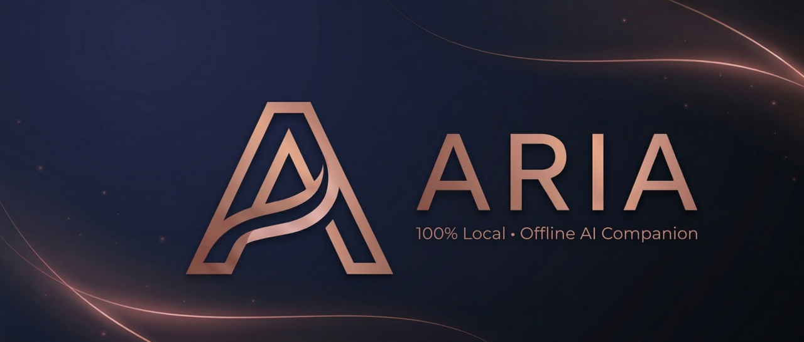

<p align="center">
  
</p>

<h1 align="center">Aria</h1>

<p align="center">
  <strong>🌹 High-End Interactive Fiction & AI Companion Suite</strong>
</p>

<p align="center">
  
  
  
  
</p>

<p align="center">
  <em>A premium, fully local AI chatbot application for immersive storytelling and character interactions.</em>
</p>

---

## ✨ Features

<table>
<tr>
<td width="50%">

### 🔒 **100% Private & Offline**

Your conversations never leave your device. Aria runs entirely on your local machine using [Ollama](https://ollama.ai), ensuring complete privacy.

### 🎭 **Custom Characters**

Create unique AI companions with custom personalities, backgrounds, and traits. Save and manage multiple characters.

### 🌍 **13 Languages**

Full localization support including English, German, Spanish, French, Italian, Portuguese, Russian, Japanese, Korean, Chinese, Arabic, Hindi, and Turkish.

</td>
<td width="50%">

### 🎨 **Stunning UI**

Rose-noir aesthetic with smooth animations, glassmorphism effects, and optional OLED dark mode. Gold mode available for supporters.

### 🔥 **Passion System**

Dynamic relationship progression with slow-burn storytelling mechanics for deeper, more meaningful interactions.

### 💡 **Smart Suggestions**

Context-aware response suggestions that adapt to the conversation flow and selected language.

</td>
</tr>
</table>

---

## 🖼️ Screenshots

> _Coming soon_

---

## 🚀 Getting Started

### Prerequisites

- **Node.js** 18+
- **Ollama** - [Download here](https://ollama.ai)
- A compatible AI model (recommended: `hermes3`, `nous-hermes2`, or any uncensored model)

### Installation

1. **Clone the repository**

   ```bash
   git clone https://github.com/Gakuseei/Aria.git
   cd Aria
   ```

2. **Install dependencies**

   ```bash
   npm install
   ```

3. **Start Ollama** (in a separate terminal)

   ```bash
   ollama serve
   ```

4. **Pull a model** (if you haven't already)

   ```bash
   ollama pull hermes3
   ```

5. **Run Aria**
   ```bash
   npm run dev
   ```

---

## 🛠️ Tech Stack

| Technology       | Purpose                    |
| ---------------- | -------------------------- |
| **Electron**     | Cross-platform desktop app |
| **React 18**     | UI components              |
| **Vite**         | Build tooling              |
| **Tailwind CSS** | Styling                    |
| **Ollama**       | Local AI inference         |
| **Lucide React** | Icons                      |

---

## 📁 Project Structure

```
Aria/
├── src/
│   ├── components/     # React components
│   ├── lib/            # Core logic (API, TTS, image gen)
│   ├── config/         # Character configurations
│   └── context/        # React contexts (Language, etc.)
├── main.js             # Electron main process
├── preload.js          # Electron preload script
└── index.html          # Entry point
```

---

## 🎮 Usage

1. **Launch Aria** - The app will automatically detect Ollama
2. **Create or select a character** - Customize their personality
3. **Start chatting** - Enjoy immersive, private AI conversations
4. **Save your sessions** - Continue conversations anytime

---

## ⚙️ Configuration

**Settings available in-app:**

- 🎨 UI Scale adjustment
- 🌙 OLED Dark Mode toggle
- 🎬 Animation toggle
- 🌍 Language selection
- 🤖 AI Model selection
- 🔥 Passion/Slow-burn settings

---

## 🤝 Contributing

Contributions are welcome! Feel free to:

1. Fork the project
2. Create a feature branch (`git checkout -b feature/amazing-feature`)
3. Commit your changes (`git commit -m 'Add amazing feature'`)
4. Push to the branch (`git push origin feature/amazing-feature`)
5. Open a Pull Request

---

## 💖 Support

If you enjoy Aria, consider supporting development:

<p align="center">
  <a href="https://ko-fi.com/gakuseei">
    
  </a>
</p>

---

## 📜 License

This project is licensed under the **MIT License** - see the [LICENSE](LICENSE) file for details.

---

<p align="center">
  Made with 🌹 by <a href="https://github.com/Gakuseei">Gakuseei</a>
</p>
