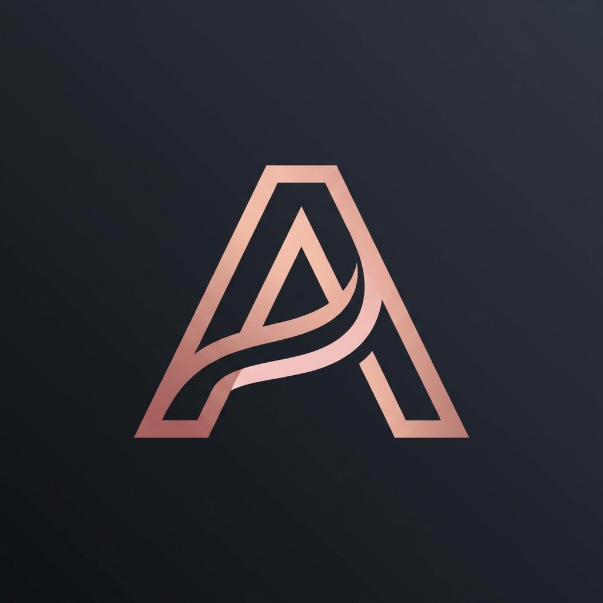

<div align="center">

<br/>



<br/><br/>

# Aria

**Local-only AI roleplay with a Passion System. No cloud. No censorship. No limits.**

<br/>

[](https://github.com/Gakuseei/Aria/stargazers)
[](LICENSE.md)
[](https://github.com/Gakuseei/Aria)
[](https://github.com/Gakuseei/Aria)

<br/>

<!-- TODO: Add screenshots or demo.gif when available -->

</div>

<br/>

---

<br/>

## Why Aria

- 🔥 **Passion System** — The AI adapts its writing depth as your conversation evolves. Six tiers from casual to transcendent. No other app does this.
- ✍️ **Impersonate** — AI writes your next message. Tokens stream live into the input field. Edit or send as-is.
- 💡 **Smart Suggestions** — Three context-aware actions after every response. Match scene intensity, never repeat.
- 🔐 **100% Offline** — Runs on [Ollama](https://ollama.ai). Nothing leaves your device. Ever.
- 🎭 **Custom Characters** — Build your own with passion speed control, or use the 5 built-in personas.
- 🌍 **13 Languages** — EN, DE, ES, ZH, FR, IT, PT, RU, JA, KO, AR, HI, TR
- 🎙️ **Voice & Image** — Piper TTS, Zonos voice synthesis, Stable Diffusion image generation.

<br/>

---

<br/>

## Status

Aria is in active development. First public release coming soon — everything is built in. Ollama installation, model selection, voice setup. One click, no terminal.

Star the repo to get notified when v1.0 drops.

<details>
<summary><strong>Run from Source</strong></summary>

<br/>

```bash
git clone https://github.com/Gakuseei/Aria.git
cd Aria
npm install
npm run dev
```

Requires Node.js v18+.

</details>

<br/>

---

<br/>

## Roadmap

- [x] **Phase 1** — Passion System v3, chat engine overhaul, smart suggestions, full manual testing
- [ ] **Phase 2** — Premium personas, chat improvements, profile pictures, chat search
- [ ] **Phase 3** — Custom installer (Ollama included), tutorial refactoring, stats dashboard
- [ ] **Phase 4** — UI overhaul, dark/light mode, new logo
- [ ] **Phase 5** — v1.0: group chats, multimodal vision, landing page
- [ ] **Phase 6** — v2.0: Full Rust rewrite with Dioxus. One binary, no Chromium.

<br/>

---

<br/>

<div align="center">

[](https://discord.gg/h3gVtkw9ja)
[](https://ko-fi.com/gakuseei)

Ko-fi supporters unlock **Gold Mode** — exclusive visuals and early access.

<br/>

MIT License — [LICENSE.md](LICENSE.md)

Made with 🌹 by [Gakuseei](https://github.com/Gakuseei)

</div>
